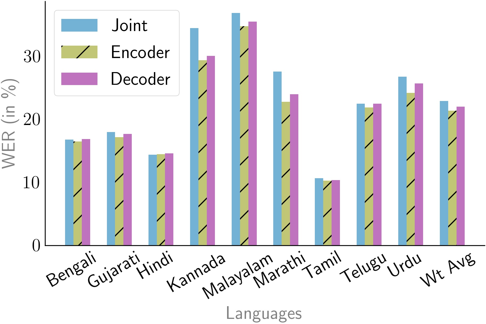
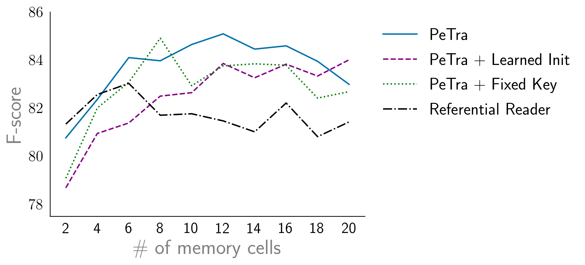
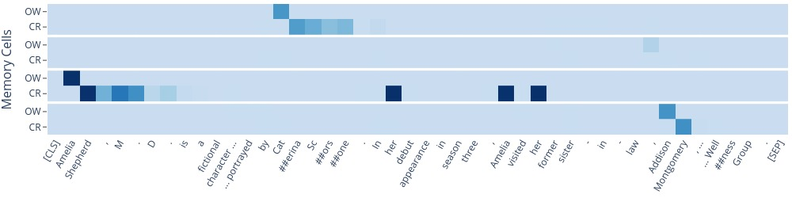
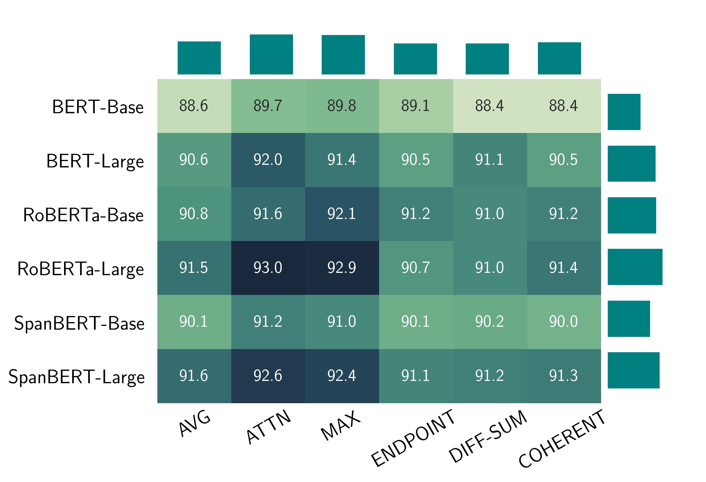
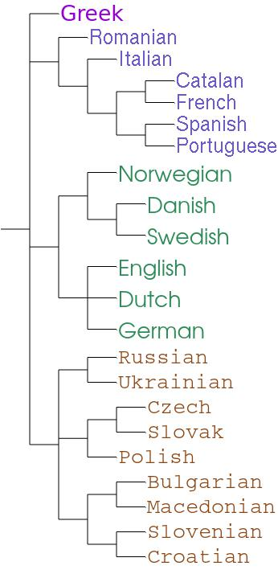

# python-plotting

While it's not clear whether our world is simulated or real, one thing is for sure that those simulations are not done with [matplotlib](https://matplotlib.org/) default settings.
The default settings are ugly to say the least. In this repository, I illustrate some of the settings I use for matplotlib. I also illustrate examples with other libraries such as [Plotly](https://plotly.com/) and [ETE](http://etetoolkit.org/). Some illustrative examples are shown below:  

Following is the list of examples with brief descriptions and links to their separate notebooks:
* [Bar Plots](https://github.com/shtoshni92/python-plotting/blob/master/notebooks/Bar%20plots.ipynb): A simple example illustrating drawing different bar plots with matplotlib. 

* [Line Plot](https://github.com/shtoshni92/python-plotting/blob/master/notebooks/Simple%20Plot.ipynb): A simple line plot. 

* [Heatmap Plotly](https://github.com/shtoshni92/python-plotting/blob/master/notebooks/Heatmap%20Plotly.ipynb): Plotly is a powerful library and in this example I illustrate a rather complicated heatmap which is relatively easy with Plotly. 

* [Subplots Matplotlib](https://github.com/shtoshni92/python-plotting/blob/master/notebooks/Subplots%20with%20Gridspec.ipynb): Example demonstrating subplots with matplotlib. This is one of the more complicated plots I have made till now.

* [Tree](https://github.com/shtoshni92/python-plotting/blob/master/notebooks/Tree.ipynb): Trees are quite common in NLP visualization. I use [ETE](http://etetoolkit.org/) to draw a phylogenetic tree in this example.

